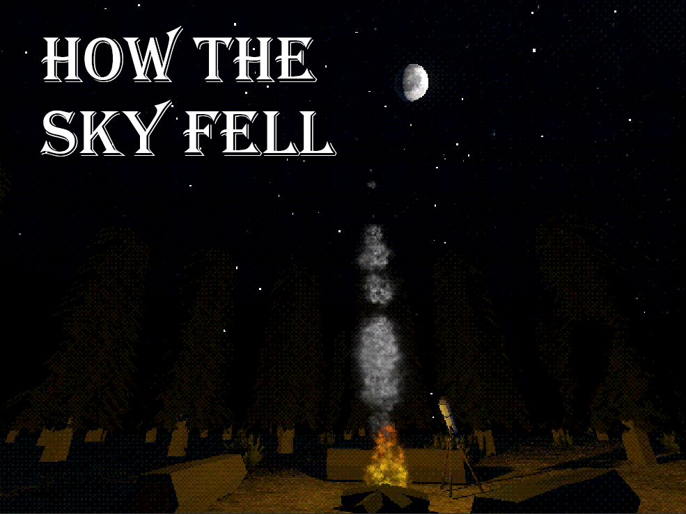
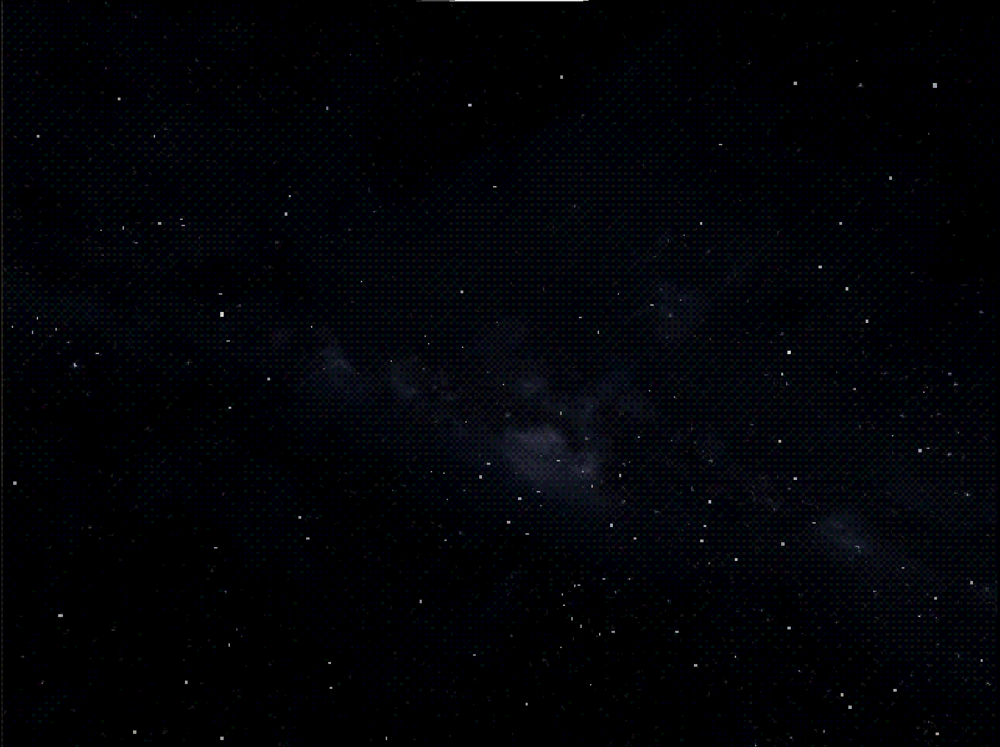
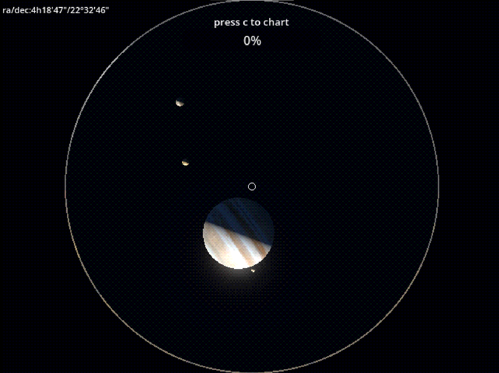
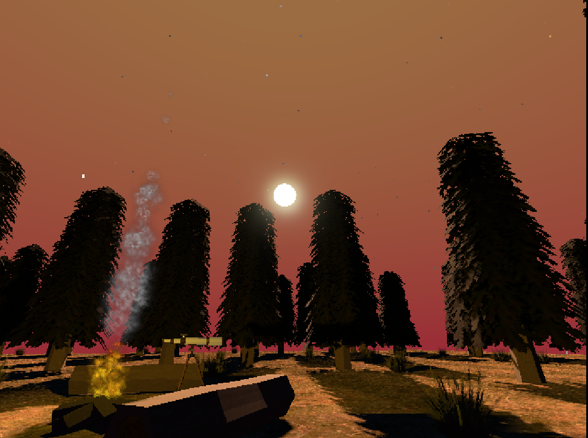
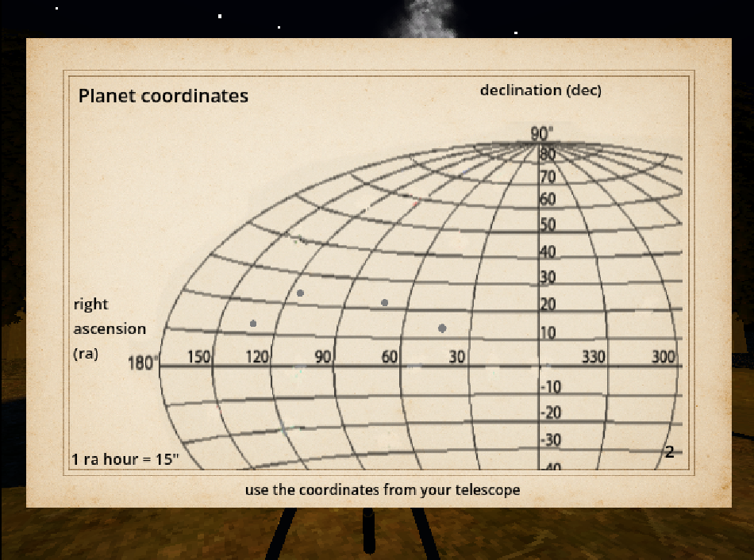
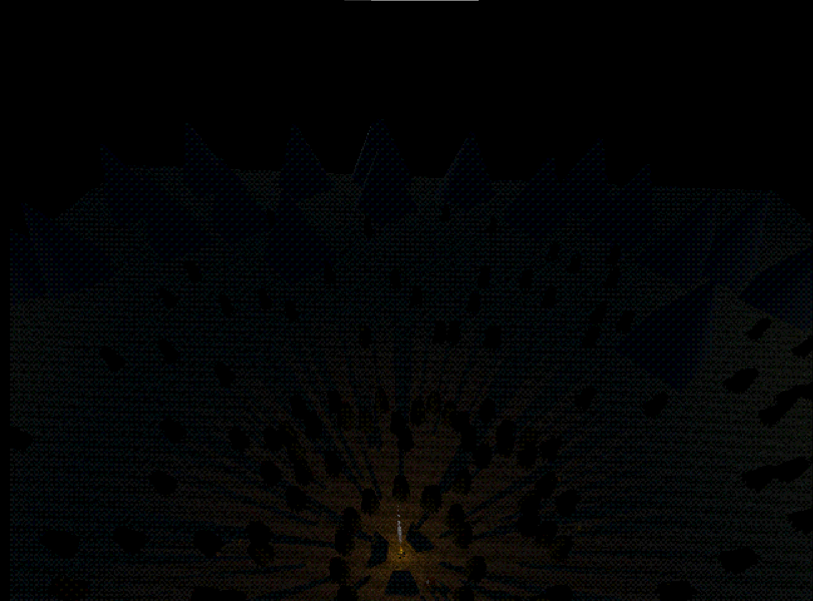
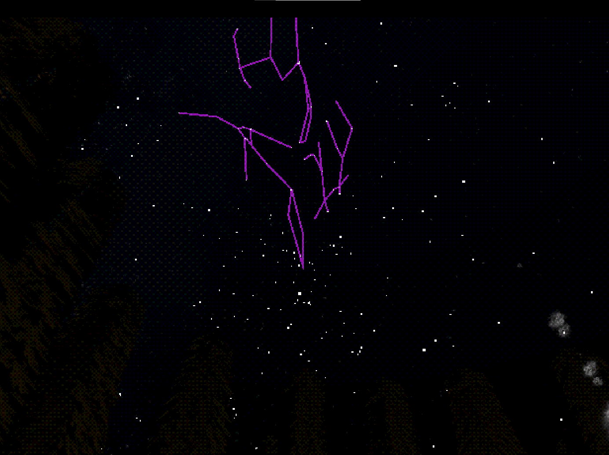

# how-the-sky-fell
Cosmic horror game about charting the sky. This is my first *completed* game and first godot project. It took me about a month finish (not counting breaks).
I used the data from [Hipparcos Planetarium Data](https://creativival.github.io/hipparcos_planetarium_data_creator/index.en.html) to generate the stars and constellations. All 3D models were made by me in blender following tutorials.
 

For more info or to play the game go to: https://rokkks.itch.io/how-the-sky-fell

### Description
You are an amateur astronomer, out in the deep woods, trying to detect the "weird" sky phenomena that have been reported. With your trusty telescope and paper maps by your side, you will chart an area of the sky by outlining the constellations and surveying the planets.

### Images

gosh i love dithering